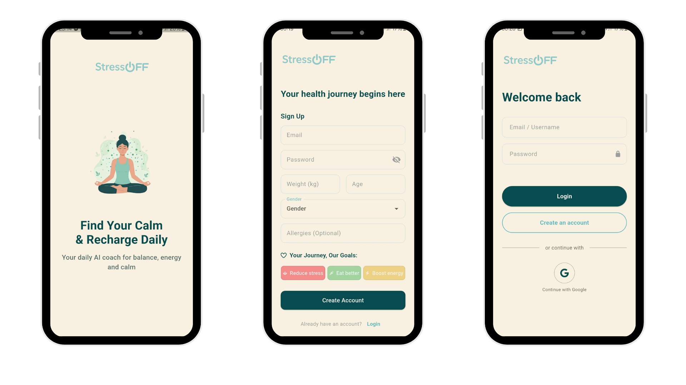
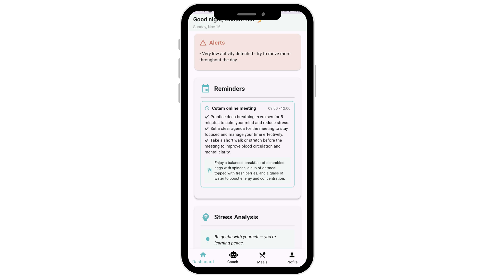
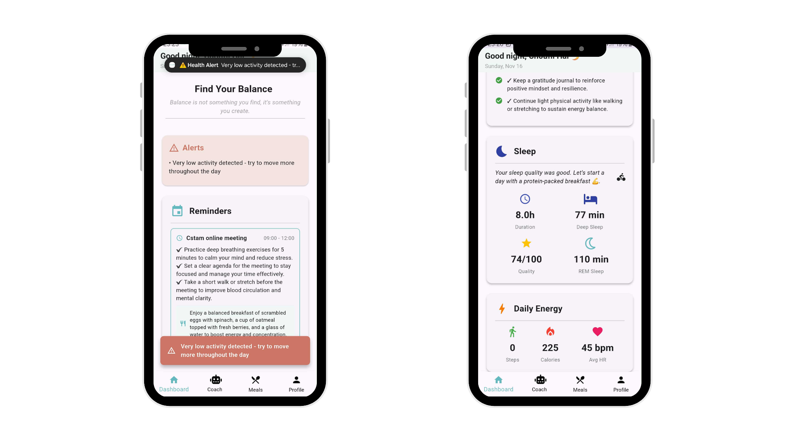
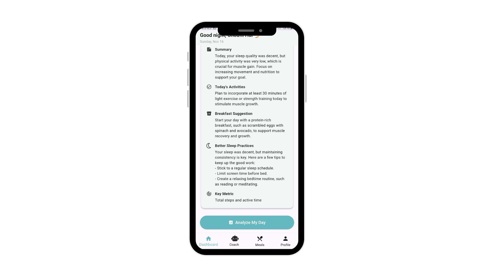
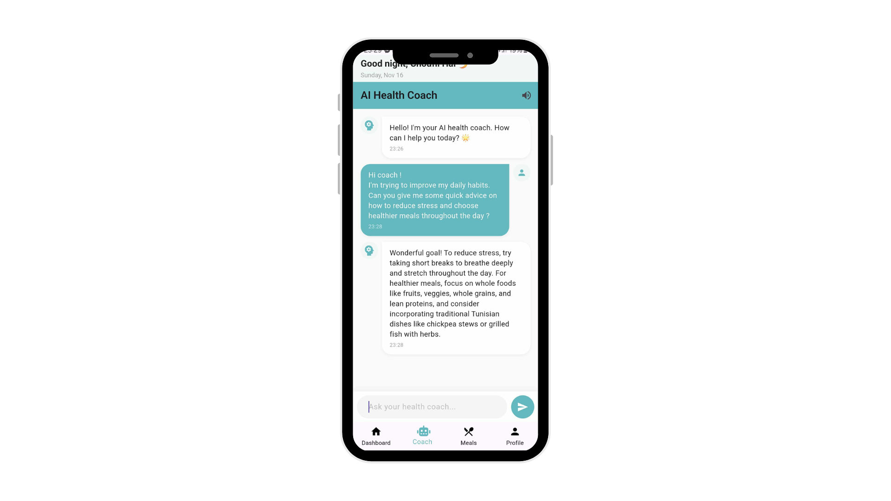
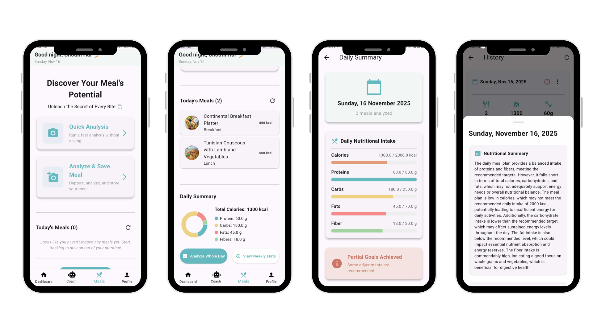
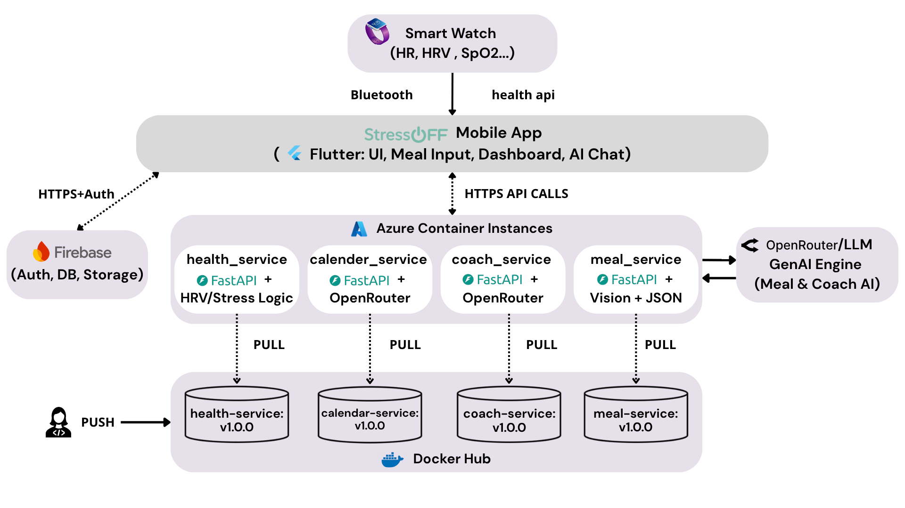

<p align="left">
  
</p>

**StressOFF** is an AI-powered wellness application designed to improve stress management, nutrition habits, and physiological balance.  
By combining smart meal analysis, real-time biometric monitoring, and calendar-aware insights, StressOFF delivers a personalized and proactive well-being experience.

The app helps users:

- Maintain healthier eating patterns  
- Improve recovery and energy levels  
- Prevent stress and fatigue peaks  
- Receive actionable, context-aware guidance powered by an AI coach  
<br>


---


<br>

# 🚀 Key Features


## 1. Authentication & Profile

### 🔐 Authentication (Signup / Login)

Users can easily create an account and securely log in using Firebase Authentication.  
This step initializes user preferences and prepares personalized tracking.

<p align="center">
  
</p>


## 2. Calendar Integration

### 📅 Calendar-Aware Insights  
StressOFF syncs with the device calendar to adjust recommendations based on daily workload:  
- **Busy days** → energizing meals, hydration, stress-relief breaks  
- **Light days** → lighter meals, sleep optimization, recovery tips  

Guidance always adapts to the user's lifestyle and schedule.

<p align="center">
  
</p>


## 3. Stress Analysis

### 🧘‍♂️ Stress Analysis  
StressOFF continuously evaluates your stress using physiological data from your smartwatch, including heart rate (HR), heart rate variability (HRV), and sleep patterns.  
It calculates a **Stress Index (0-100)** and provides actionable insights:  
- Visual stress level indicator (Low / Moderate / High)  
- Personalized stress-relief tips and daily recommendations  
- Motivational quotes to improve mental well-being  
- Instant notifications for high stress or anomalies  

<p align="center">
  
</p>


## 4. Real-Time Physiological Monitoring

### ❤️ Real-Time Health Monitoring  
When paired with a smartwatch, StressOFF tracks key physiological metrics:  
- Heart Rate (HR)  
- Heart Rate Variability (HRV)  
- Blood Oxygen Level (SpO₂)  
- Active minutes & burned calories  
- Sleep duration and quality  

The system sends **instant alerts** when anomalies appear, along with actionable advice.

<p align="center">
  
</p>


## 5. Daily Summary & Personalized Recommendations

### 📊 Daily Summary  
Each evening, the app generates a personalized recap including:  
- Total calorie intake  
- Nutritional balance  
- Excesses and deficiencies  
- Tailored recommendations for the next day  

This helps users maintain healthy and consistent eating habits.

<p align="center">
  
</p>


## 6. AI Coach Chatbot

### 🤖 AI Wellness Coach  
A smart conversational assistant offering:  
- Personalized health and nutrition advice  
- Stress-relief exercises  
- Motivation and gentle reminders  
- Context-aware suggestions based on meals, health metrics, and daily plan  

<p align="center">
  
</p>


## 7. Smart Meal Analysis (AI-Powered)

### 🍽️ Smart Meal Analysis  
StressOFF allows users to take a photo of their meal and instantly receive:  
- Ingredient detection  
- Nutritional estimation  
- Personalized dietary advice  

**Two analysis modes:**  
- **Meal Analysis** — saves the evaluation to Firebase  
- **Quick Analysis** — instant analysis without saving  

<p align="center">
  
</p>


### 8. 👤 User Profile


The Profile page displays personal information, health preferences, and allows users to adjust their stress or nutrition goals.

<p align="center">
  
</p>
<br>


---


<br>

## 🔁 Workflow Overview

This diagram summarizes how StressOFF works end-to-end:

<p align="center">
  
</p>

### 📱 Mobile App (Flutter)
- Captures meal photos and smartwatch data.
- Sends requests to cloud microservices.
- Displays insights, alerts, and recommendations.

### ☁️ Firebase
- Manages authentication.
- Stores meals, summaries, and health logs.

### 🐳 Cloud Microservices (Azure + Docker)
- Each service is containerized and deployed on Azure:
  - **meal_service** → AI meal analysis  
  - **coach_service** → AI coaching & guidance  
  - **health_service** → HR/HRV/SpO₂ analysis  
  - **calendar_service** → context from user schedule

### 🤖 OpenRouter AI
- Vision model analyzes meals.
- LLM generates recommendations and insights.

### 🔄 Feedback to User
- The app receives nutrition results, stress alerts, and daily summaries in real time.

<br>

## 🛠 Tech Stack  

| Layer | Technology |
|-------|------------|
| **Backend** | FastAPI, Python 3.13 |
| **Frontend** | Flutter |
| **Database** | Firebase Firestore |
| **AI Models** | Qwen Vision (image), Qwen / Meta-Llama (text) via OpenRouter API |
| **Cloud & Deployment** | Microsoft Azure (App Service, Storage, Monitoring) |
| **Containerization** | Docker (backend containerization & deployment) |
<br>


---


<br>

## ⚙️ Installation & Run 

### 1. Clone the repo

```bash
git clone https://github.com/username/stressoff.git
cd stressoff/backend
pip install -r requirements.txt


### 2. Build Docker images locally

```bash
# Coach service
docker build -f coach_service/Dockerfile -t <dockerhub-username>/coach-service:local .

# Health service
docker build -f health_service/Dockerfile -t <dockerhub-username>/health-service:local .

# Meal service
docker build -f meal_service/Dockerfile -t <dockerhub-username>/meal-service:local .


